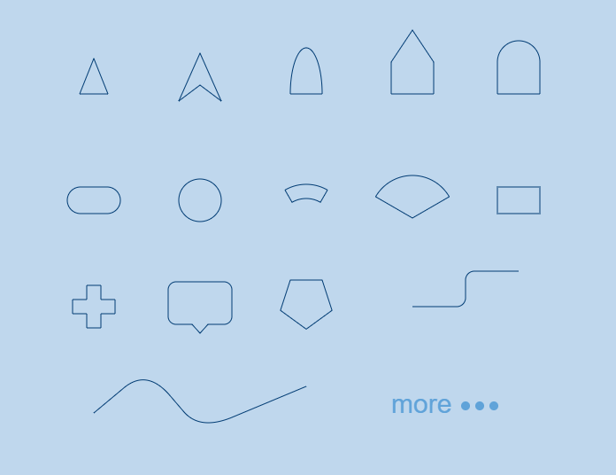

# Impressionist

Impressionist is a **Path Generator** for **Canvas and SVG**.  

Don't need to google and try to build the basic shapes with mathmatics `sin, cos, exp and %^!??`, it's a sheer waste of time.

All the shapes are generated as **a single path string** to keep it performant and maintainable.  



### supported pathes

- circle
  - basic circle, aligned or symmetrical
- circular
  - sector, radians or degrees
  - pie, radians or degrees
- line
  - simple two points line
  - fold line
- step
  - step line, with round corner, relative or absolute
- polygon
  - self-customed polygon
  - regular polygon
- rectangle
  - basic rectangle, with round corner, alinged or symmetrical
  - diamond, alinged or symmetrical
  - parallelogram, alinged or symmetrical
- triangle
  - equilateral, alinged or symmetrical
  - isosceles, alinged or symmetrical
- capsule
  - row
- bezier curve
  - simple quadratic bezier curve
  - simple cubic bezier curve
  - continuous quadratic bezier curve
  - continuous cubic bezier curve
- arrow
  - basic arrow
  - vee arrow
  - triangle arrow
  - blunt arrow
  - dome arrow
  - bullet arrow
- common shapes
  - plus
  - popup

### Install

`npm install impressionist --save`

### Usage

import the circle, rectangle from impressionist library,  
and stroke it!
You can use it in React, Vue, or just vanilla js.

```javascript
// draw rectangle at position (x, y)
const r1 = rectangle.basic(x, y, width, height);

// draw rounded rectangle at position (x, y)
const r2 = rectangle.round(x, y, width, height, radius);

// draw regular polygon, with given sides and size
const p1 = polygon.regular(x, y, sides, size);

// draw triangle, with given side length
const t1 = triangle.equilateral(x, y, length);
```

### Quick Start

You can double click the `index.html` in `/exmaples` directory to run the example.    

```javascript
// import shapes
import { rectangle, polygon, curve, circle } from "impressionist";

const canvas = document.getElementById("graph");
const ctx = canvas.getContext("2d");

// create rectangle, with x, y, width, height, and round coner
const rect = new Path2D(rectangle.round(300, 300, 200, 100, 20));
ctx.stroke(rect);

// create circle, with x, y, radius
const circle1 = new Path2D(circle.basic(420, 300, 6));
ctx.stroke(circle1);

// create rectangle, with x, y, width, height
// the rectangle is aligned with top-left, which is convinient to build UI.
const rect = new Path2D(rectangle.basicAligned(900, 500, 200, 100));

// create curve, with points and curve ratio
const cur = new Path2D(
  curve.multi(
    [
      [420, 300],
      [520, 460],
      [720, 300],
    ],
    200
  )
);
ctx.stroke(cur);

// create circle, with x, y, radius
const circle2 = new Path2D(circle.basic(720, 300, 6));
ctx.stroke(circle2);

// create regular polygon, with 5 sides and size
const polygon1 = new Path2D(polygon.regular(800, 240, 5, 80));
ctx.stroke(polygon1);
```

### License

MIT
